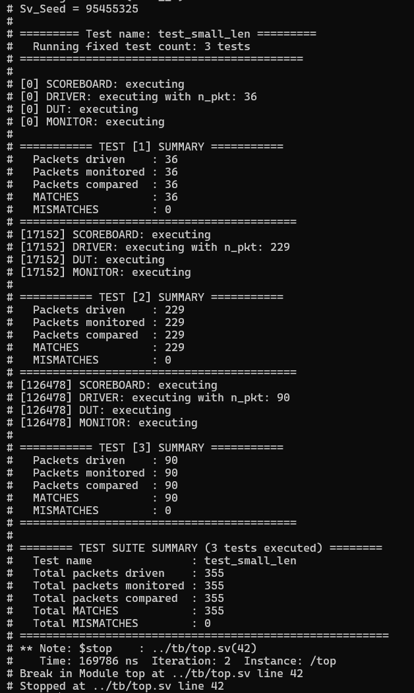

# Testbench Assignment Review Guide

This README summarizes the changes and features added in response to the feedback from July 3 and July 7. Each point includes a brief explanation and relevant code snippets.

---
## Feedback Response (1): Jul 3

### 1. Removed Queues from Scoreboard

**Comment:** Use associative arrays only, no queues.

**Solution:** Packets are now stored using associative arrays indexed by `id`, and compared as soon as both expected and actual packets are received.

```systemverilog
task execute();
  $display("[%0t] SCOREBOARD: executing", $time);
  fork
    // Expected path
    begin
      packet p;
      forever begin
        mbox_exp.get(p);
        exp_map[p.id] = p;
        if (act_map.exists(p.id))
          compare_and_cleanup(p.id);
      end
    end

    // Actual path
    begin
      packet p;
      forever begin
        mbox_act.get(p);
        act_map[p.id] = p;
        if (exp_map.exists(p.id))
          compare_and_cleanup(p.id);
      end
    end

    // Watcher (see next point)
    begin
      wait(driver_finished);
      repeat(5) @(negedge bfm.clk);
      finished = 1;
    end
  join_none
endtask
```

---

### 2. Scoreboard‑Driven Test Termination

**Comment:** Let the scoreboard signal test end.

**Solution:** A watcher thread inside the scoreboard waits for the driver to finish, then allows time for remaining comparisons before setting `finished`. The testbench waits for this flag.

```systemverilog
begin : WATCHER
  wait (driver_finished);
  repeat (5) @(negedge bfm.clk);
  finished = 1;
end
```

In `testbench.execute()`:

```systemverilog
fork : exec_group
  scoreboard_h.execute();
  driver_h.execute(n_pkt);
  dut_h.execute();
  monitor_h.execute();
join_none

wait(driver_h.finished);
scoreboard_h.driver_finished = 1;
wait(scoreboard_h.finished);
disable exec_group;
report_h.report_results();
```

---

### 3. Parallel Comparison

**Comment:** Comparison must run in parallel with driving and monitoring.

**Solution:** The scoreboard’s expected and actual input threads are forked to allow real-time comparison while packets are still being driven and monitored.

---

### 4. Out‑of‑Order DUT Model

**Comment:** Create a dummy DUT that reorders packets.

**Solution:** The first packet is delayed using `#delay`, while the rest are passed immediately in a parallel loop. This causes the first packet to arrive late.

```systemverilog
task execute();
  m_in.get(pkt_in1);
  delay = $urandom_range(300, 500);
  fork
    #delay m_out.put(pkt_in1);
    forever begin
      m_in.get(pkt_in2);
      m_out.put(pkt_in2);
    end
  join
endtask
```

---

### 5. Reporting Mechanism

**Comment:** Add a reporting mechanism to track statistics.

**Solution:** Created a `report_object` with counters and a `report_results()` function. Each component has its own handle to this class and updates its corresponding fields.

```systemverilog
class report_object;
  int test_num, driven_count, monitored_count;
  int compared_count, match_count, mismatch_count;

  function void report_results();
    $display("");
    $display("=== TEST [%0d] SUMMARY ===", test_num);
    $display("  Driven    : %0d", driven_count);
    $display("  Monitored : %0d", monitored_count);
    $display("  Compared  : %0d", compared_count);
    $display("  MATCHES   : %0d", match_count);
    $display("  MISMATCHS : %0d", mismatch_count);
  endfunction
endclass
```

---

### 6. Multiple Test Runs

**Comment:** Run several tests with random `n_pkt`.

**Solution:** Repeated the testbench three times in `top.sv` with random packet counts.

```systemverilog
repeat (3) begin
  num_test++;
  report_h = new(num_test);
  testbench_h = new(report_h, bfm);
  n_pkt = $urandom_range(1, 256);
  testbench_h.execute(n_pkt);
end
$stop;
```

### 7. Simulation Results using QuestaSim
Running 3 tests sequentially:


---

## Feedback Response (2): Jul 7

### 1. Plusargs Support for Test Control

**Comment:** Use plusargs to choose the name of the test and number of runs.

**Solution:** Used `TEST_NAME` and `NUM_TEST` plusargs to configure test name and count. Created flags for fixed/random runs.

```systemverilog
if($value$plusargs("TEST_NAME=%s", test_name)) begin
  if(test_name == "test_small_len")
    is_small_len = 1;
end else begin
  test_name = "default_test";
end

if($value$plusargs("NUM_TEST=%0d", num_test))
  is_rand_num_test = 0;
```

> Note: It's more robust to use an associative array of test names, but this approach is sufficient to demonstrate plusargs handling.

---

### 2. Enhanced Reporting Suite

**Comment:** Make the report object capable of total suite summary.

**Solution:** The `report_object` now tracks both per-test and total suite-level stats. At the end of each test, it updates totals and prints the overall summary.

```systemverilog
function void report_suite_summary();
  $display("");
  $display("======== TEST SUITE SUMMARY (%0d tests executed) ========", num_test);
  $display("  Test name               : %s", test_name);
  $display("  Total packets driven    : %0d", driven_count_total);
  $display("  Total packets monitored : %0d", monitored_count_total);
  $display("  Total packets compared  : %0d", compared_count_total);
  $display("  Total MATCHES           : %0d", match_count_total);
  $display("  Total MISMATCHES        : %0d", mismatch_count_total);
  $display("========================================================");
endfunction
```

---

### 3. Move Comparison to Packet Class

**Comment:** Move the comparison method to the `packet` class.

**Solution:** The `compare()` function was moved into the `packet` class and now receives a `report_object` to update statistics.

```systemverilog
function void compare(input packet rhs, inout report_object rep);
  if (this.data != rhs.data) begin
    $error("[%0t] MISMATCH ID=%0d exp.len=%0d act.len=%0d",
           $time, this.id, this.n, rhs.n);
    rep.mismatch_count++;
  end else begin
    rep.match_count++;
  end
endfunction
```

### 4. Simulation Results using QuestaSim
Running 3 tests sequentially:



---

*End of guide.*
